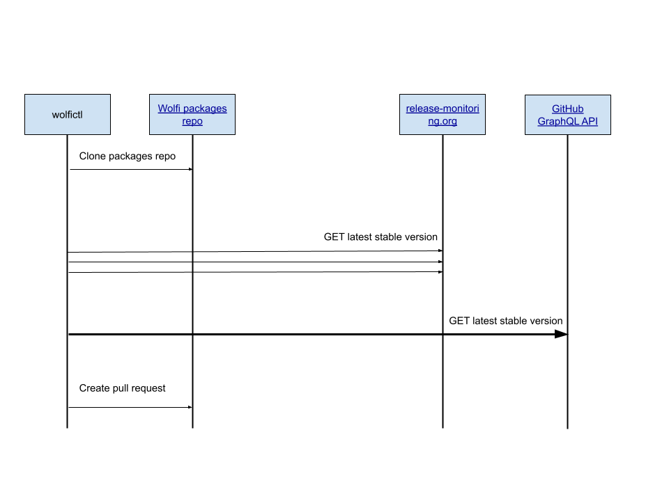

# Automated package updates

Wolfi packages are kept up-to-date with the latest upstream releases.

A melange package config can contain an `update:` section which you can read about more by visiting the related [melange docs](https://github.com/chainguard-dev/melange/blob/main/docs/UPDATE.md)

The Wolfi project itself has built automation that fetches the latest package versions from a variety of backend APIs and will create an automated pull request on Wolfi when a new version is available.  You can read more about this automation at the [wolfictl update docs](https://github.com/wolfi-dev/wolfictl/blob/main/docs/update.md)

## Contributing

When contributing a new package decide which backend the Wolfi Bot should use to discover latest release versions.  The two currently available are

- `update.release-monitor` using https://release-monitoring.org
- `update.github` using GitHub's Graphql API https://api.github.com/graphql

To help you decide here are a few things to consider:

### Release Monitor

- Latest Package versions returned do not always represent the real latest version.  For example GitHub projects that don't use GitHub releases or publish patch releases for previous versions after a newer version.

Examples of these are [kustomize](https://release-monitoring.org/project/21003/) and [jenkins](https://release-monitoring.org/project/5493/)

- The Wolfi Bot uses the Release Monitor REST API to query for new versions rather than subscribing to the Topic queue.  This is to reduce infrastructure needs for Wolfi as we can query the REST API in a [GitHub Action](https://github.com/wolfi-dev/os/blob/main/.github/workflows/wolfictl-update-rm.yaml#L22-L25).  A single request is sent for each package we want to check, to avoid DoS'ing the Release Monitor API we do this once per day.

### GitHub

In comparison to the drawbacks described above with Release Monitor, configuring a GitHub backend in the melange config gives greater control and flexibility.  For example GitHub projects that don't use GitHub releases are supported as well as projects like Kustomize and Jenkins which create releases in a different way to other projects.

The GitHub backend implementation uses GitHub's GraphQL API and so we can send a single request which returns the latest versions for many projects.  This means the CRON job runs once per hour.

### Adding new projects to Release Monitor

If your project is not listed in Release Monitor, you can sign up for a free account and add the project you are interested in.